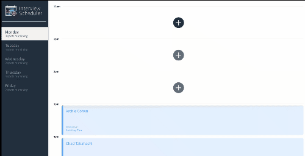
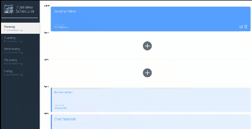
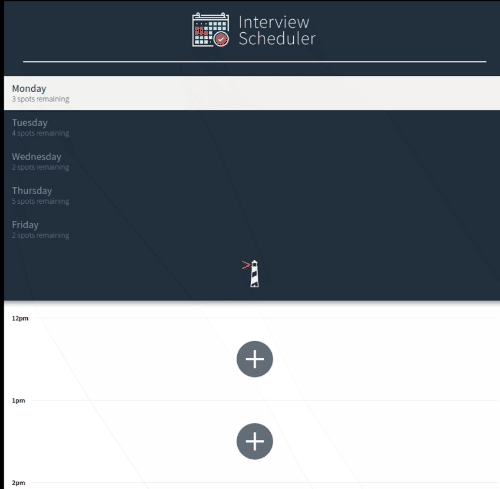

# Interview Scheduler

## Description

A responsive single-page scheduler built using React (with Hooks) and using an API with a WebSocket server for a realtime experience.
Storybook used to build and view React components in isolation.
Integration tests implemented using Jest. End-to-end testing implemented using Cypress.

## Screenshots

 



## Setup

Install dependencies with `npm install`.

## Running Webpack Development Server

```sh
npm start
```

## Running Jest Test Framework

```sh
npm test
```

## Running Storybook Visual Testbed

```sh
npm run storybook
```
